# Fashion Retail Data Model

This document describes the star schema data model for the fashion retail analytics platform.

## Overview

The model consists of:
- **6 Dimension Tables** (customers, products, locations, dates, channels, time)
- **5 Fact Tables** (sales, inventory, customer events, cart abandonment, demand forecasts)
- **3 Bridge/Aggregate Tables** (affinity scores, size fit, inventory movements)

## Entity Relationship Diagram

```mermaid
erDiagram
    %% Dimension Tables
    GOLD_CUSTOMER_DIM {
        int customer_key PK
        string customer_id UK
        string email
        string first_name
        string last_name
        string segment
        double lifetime_value
        date acquisition_date
        string acquisition_channel
        string preferred_channel
        string preferred_category
        string size_profile_tops
        string size_profile_bottoms
        string geo_region
        string geo_city
        int nearest_store_id
        string loyalty_tier
        boolean email_subscribe_flag
        boolean sms_subscribe_flag
        date effective_date
        date expiration_date
        boolean is_current
        string source_system
        timestamp etl_timestamp
    }

    GOLD_PRODUCT_DIM {
        int product_key PK
        string product_id UK
        string sku
        string product_name
        string brand
        string category_level_1
        string category_level_2
        string category_level_3
        string color_family
        string color_name
        string size_range
        string material_primary
        string material_composition
        string season_code
        string collection_name
        date launch_date
        date end_of_life_date
        double base_price
        double unit_cost
        double margin_percent
        string price_tier
        boolean sustainability_flag
        boolean is_active
        string source_system
        timestamp etl_timestamp
    }

    GOLD_LOCATION_DIM {
        int location_key PK
        string location_id UK
        string location_name
        string location_type
        string address
        string city
        string state
        string postal_code
        string country
        double latitude
        double longitude
        string timezone
        int square_footage
        boolean is_flagship
        date opened_date
        boolean is_active
        string source_system
        timestamp etl_timestamp
    }

    GOLD_DATE_DIM {
        int date_key PK
        date calendar_date UK
        int year
        int quarter
        int month
        int day_of_month
        int day_of_week
        string day_name
        string month_name
        boolean is_weekend
        boolean is_holiday
        string holiday_name
        string season
        int fiscal_year
        int fiscal_quarter
        int fiscal_month
        int week_of_year
        boolean is_last_day_of_month
        string source_system
        timestamp etl_timestamp
    }

    GOLD_CHANNEL_DIM {
        int channel_key PK
        string channel_id UK
        string channel_name
        string channel_type
        boolean is_digital
        boolean is_physical
        double commission_rate
        string attribution_window
        boolean is_active
        string source_system
        timestamp etl_timestamp
    }

    GOLD_TIME_DIM {
        int time_key PK
        string time_id UK
        int hour
        int minute
        string time_period
        string business_period
        boolean is_business_hours
        string source_system
        timestamp etl_timestamp
    }

    %% Fact Tables
    GOLD_SALES_FACT {
        string transaction_id PK
        int customer_key FK
        int product_key FK
        int location_key FK
        int date_key FK
        int time_key FK
        int channel_key FK
        string order_id
        string line_item_id
        int quantity
        double unit_price
        double discount_amount
        double tax_amount
        double line_total
        double unit_cost
        double gross_margin
        string size_ordered
        string color_ordered
        string payment_method
        string promotion_code
        boolean is_return
        date return_date
        string return_reason
        string sales_associate_id
        string source_system
        timestamp etl_timestamp
    }

    GOLD_INVENTORY_FACT {
        int product_key FK
        int location_key FK
        int date_key FK
        int quantity_on_hand
        int quantity_reserved
        int quantity_available
        int quantity_in_transit
        double total_value
        double days_of_supply
        boolean is_stockout
        boolean is_overstock
        int reorder_point
        int max_stock_level
        date last_replenishment_date
        date next_expected_delivery
        string source_system
        timestamp etl_timestamp
    }

    GOLD_CUSTOMER_EVENT_FACT {
        long event_id PK
        string session_id
        int customer_key FK
        int product_key FK
        int location_key FK
        int channel_key FK
        int date_key FK
        int time_key FK
        string event_type
        double event_value
        string page_url
        string referrer_url
        string user_agent
        string device_type
        boolean conversion_flag
        string campaign_id
        string source_system
        timestamp etl_timestamp
    }

    GOLD_CART_ABANDONMENT_FACT {
        int abandonment_id PK
        string cart_id
        int customer_key FK
        int date_key FK
        int time_key FK
        int channel_key FK
        double cart_value
        int items_count
        int minutes_in_cart
        boolean recovery_email_sent
        boolean recovery_email_opened
        boolean recovery_email_clicked
        boolean is_recovered
        int recovery_date_key FK
        double recovery_revenue
        string abandonment_stage
        string suspected_reason
        string source_system
        timestamp etl_timestamp
    }

    GOLD_DEMAND_FORECAST_FACT {
        int forecast_id PK
        date forecast_date
        int product_key FK
        int location_key FK
        int date_key FK
        double forecast_quantity
        double forecast_revenue
        double confidence_lower_bound
        double confidence_upper_bound
        double confidence_level
        double actual_quantity
        double actual_revenue
        double forecast_accuracy
        double mape
        double bias
        string model_version
        string model_type
        string source_system
        timestamp etl_timestamp
    }

    %% Bridge and Aggregate Tables
    GOLD_CUSTOMER_PRODUCT_AFFINITY_AGG {
        int customer_key FK
        int product_key FK
        int purchase_count
        double total_spent
        int view_count
        int cart_add_count
        double affinity_score
        int days_since_last_interaction
        double view_to_purchase_ratio
        double cart_to_purchase_ratio
        double predicted_cltv_impact
        string source_system
        timestamp etl_timestamp
    }

    GOLD_SIZE_FIT_BRIDGE {
        int customer_key FK
        int product_key FK
        string ordered_size
        string kept_size
        string recommended_size
        boolean is_returned
        string return_reason
        double fit_score
        string fit_description
        string feedback_comments
        string source_system
        timestamp etl_timestamp
    }

    GOLD_INVENTORY_MOVEMENT_FACT {
        string movement_id PK
        int product_key FK
        int from_location_key FK
        int to_location_key FK
        int date_key FK
        int time_key FK
        string movement_type
        string movement_reason
        int quantity
        double unit_cost
        double total_cost
        string reference_type
        string reference_id
        string source_system
        timestamp etl_timestamp
    }

    %% Relationships
    GOLD_CUSTOMER_DIM ||--o{ GOLD_SALES_FACT : customer_key
    GOLD_PRODUCT_DIM ||--o{ GOLD_SALES_FACT : product_key
    GOLD_LOCATION_DIM ||--o{ GOLD_SALES_FACT : location_key
    GOLD_DATE_DIM ||--o{ GOLD_SALES_FACT : date_key
    GOLD_TIME_DIM ||--o{ GOLD_SALES_FACT : time_key
    GOLD_CHANNEL_DIM ||--o{ GOLD_SALES_FACT : channel_key

    GOLD_PRODUCT_DIM ||--o{ GOLD_INVENTORY_FACT : product_key
    GOLD_LOCATION_DIM ||--o{ GOLD_INVENTORY_FACT : location_key
    GOLD_DATE_DIM ||--o{ GOLD_INVENTORY_FACT : date_key

    GOLD_CUSTOMER_DIM ||--o{ GOLD_CUSTOMER_EVENT_FACT : customer_key
    GOLD_PRODUCT_DIM ||--o{ GOLD_CUSTOMER_EVENT_FACT : product_key
    GOLD_LOCATION_DIM ||--o{ GOLD_CUSTOMER_EVENT_FACT : location_key
    GOLD_CHANNEL_DIM ||--o{ GOLD_CUSTOMER_EVENT_FACT : channel_key
    GOLD_DATE_DIM ||--o{ GOLD_CUSTOMER_EVENT_FACT : date_key
    GOLD_TIME_DIM ||--o{ GOLD_CUSTOMER_EVENT_FACT : time_key

    GOLD_CUSTOMER_DIM ||--o{ GOLD_CART_ABANDONMENT_FACT : customer_key
    GOLD_DATE_DIM ||--o{ GOLD_CART_ABANDONMENT_FACT : date_key
    GOLD_DATE_DIM ||--o{ GOLD_CART_ABANDONMENT_FACT : recovery_date_key
    GOLD_TIME_DIM ||--o{ GOLD_CART_ABANDONMENT_FACT : time_key
    GOLD_CHANNEL_DIM ||--o{ GOLD_CART_ABANDONMENT_FACT : channel_key

    GOLD_PRODUCT_DIM ||--o{ GOLD_DEMAND_FORECAST_FACT : product_key
    GOLD_LOCATION_DIM ||--o{ GOLD_DEMAND_FORECAST_FACT : location_key
    GOLD_DATE_DIM ||--o{ GOLD_DEMAND_FORECAST_FACT : date_key

    GOLD_CUSTOMER_DIM ||--o{ GOLD_CUSTOMER_PRODUCT_AFFINITY_AGG : customer_key
    GOLD_PRODUCT_DIM ||--o{ GOLD_CUSTOMER_PRODUCT_AFFINITY_AGG : product_key

    GOLD_CUSTOMER_DIM ||--o{ GOLD_SIZE_FIT_BRIDGE : customer_key
    GOLD_PRODUCT_DIM ||--o{ GOLD_SIZE_FIT_BRIDGE : product_key

    GOLD_PRODUCT_DIM ||--o{ GOLD_INVENTORY_MOVEMENT_FACT : product_key
    GOLD_LOCATION_DIM ||--o{ GOLD_INVENTORY_MOVEMENT_FACT : from_location_key
    GOLD_LOCATION_DIM ||--o{ GOLD_INVENTORY_MOVEMENT_FACT : to_location_key
    GOLD_DATE_DIM ||--o{ GOLD_INVENTORY_MOVEMENT_FACT : date_key
    GOLD_TIME_DIM ||--o{ GOLD_INVENTORY_MOVEMENT_FACT : time_key
```

## Table Descriptions

### Dimension Tables

- **`gold_customer_dim`**: Customer master data with segments, preferences, and slowly changing attributes
- **`gold_product_dim`**: Product catalog with hierarchy, pricing, and attributes
- **`gold_location_dim`**: Store, warehouse, and distribution center locations
- **`gold_date_dim`**: Date attributes with fiscal calendar and seasonality
- **`gold_channel_dim`**: Sales/interaction channels (web, mobile, store, etc.)
- **`gold_time_dim`**: Time of day attributes with business hour classifications

### Fact Tables

- **`gold_sales_fact`**: Transactional sales data with customer, product, and location context
- **`gold_inventory_fact`**: Daily inventory snapshots by product and location
- **`gold_customer_event_fact`**: Digital interaction events (page views, searches, clicks)
- **`gold_cart_abandonment_fact`**: Shopping cart abandonment events with recovery tracking
- **`gold_demand_forecast_fact`**: ML-generated demand forecasts with accuracy metrics

### Bridge/Aggregate Tables

- **`gold_customer_product_affinity_agg`**: Customer-product affinity scores for personalization
- **`gold_size_fit_bridge`**: Size/fit feedback and recommendations
- **`gold_inventory_movement_fact`**: Inventory transfer and adjustment transactions

## Use Cases Supported

1. **Real-time Personalization**: Customer-product affinity scores and preferences
2. **Inventory Optimization**: Cross-location inventory balancing and demand planning
3. **Demand Forecasting**: ML-driven sales predictions with accuracy tracking
4. **Size/Fit Optimization**: Return analysis and size recommendation improvements
5. **Customer Analytics**: Journey analysis, segmentation, and lifetime value
6. **Channel Performance**: Omnichannel sales and engagement analysis

## Data Volumes (Test Configuration)

- Customers: 10
- Products: 5
- Locations: 13
- Historical Days: 30
- Events per Day: 10

**Expected Record Counts**:
- Sales Fact: ~150 transactions
- Customer Events: ~300 events
- Inventory Fact: ~1,950 daily snapshots (5 products × 13 locations × 30 days)
- Cart Abandonment: ~2,310 records
- Demand Forecast: ~750 forecasts

## Key Relationships

The model follows a classic star schema pattern:
- Each fact table connects to multiple dimensions via foreign keys
- Time-based facts use both `date_key` and `time_key` for granular analysis
- Location-based facts support multi-location analysis (stores, warehouses, DCs)
- Customer events track the full digital journey from awareness to purchase